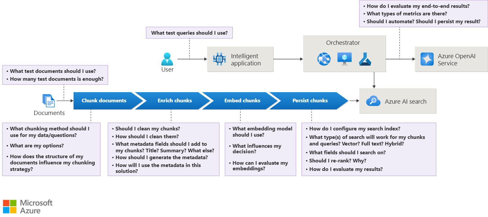

# CAO Processor

A small toolkit for parsing CAO (Collective Labour Agreement) PDFs and extracting structured information (clauses, articles, dates, salary tables, scopes, and metadata).

This repository contains utilities, experiments and data for extracting machine-readable information from CAO PDFs used in the Netherlands. It is intended as a starting point for automation, search, and downstream analysis of collective labour agreements.

## Features

- Extract text from CAO PDF documents
- Heuristics and NLP-friendly preprocessing for identifying clause headings, numbered articles, tables and dates
- Notebook-based experiments and prototyping under `src/notebooks/`
- Place to add document-specific parsers and an extraction pipeline to produce JSON/CSV outputs

## Quickstart

Prerequisites

- Python 3.13+ (see `pyproject.toml`)
- Optional: a virtual environment recommended

Install dependencies (from project root):

```powershell
# create and activate a venv on Windows PowerShell
python -m venv .venv
.\.venv\Scripts\Activate.ps1
python -m pip install --upgrade pip
# install the package in editable mode (pulls dependencies from pyproject.toml)
pip install -e .
```

Run the simple entrypoint (sanity check):

```powershell
python main.py
# prints: "Hello from cao-processor!"
```

Example: extract raw text from a CAO PDF using `pdfplumber` (small example you can run in a script or notebook):

```python
import pdfplumber

path = "data/cao-pdfs/Cao Bouw en Infra 2025 - 2027.pdf"

with pdfplumber.open(path) as pdf:
	text = "\n\n".join(page.extract_text() or "" for page in pdf.pages)

print(text[:1000])  # preview first 1000 chars
```

From the raw text you can implement rule-based or ML-based extractors to find article numbers, headings, salary brackets, and effective dates.

## Data layout

- `data/cao-pdfs/` — sample CAO PDF files used for development and tests (kept out of packaging by default)
- `src/notebooks/` — exploratory notebooks and experiments (prototypes for extraction ideas)

Place additional input PDFs under `data/cao-pdfs/` and keep original filenames to make batch runs reproducible.

## Project structure

- `main.py` — minimal entrypoint / sanity script
- `pyproject.toml` — project metadata and dependency list
- `src/` — source code and notebooks (add modules here: parser, extractor, cli)
- `data/` — input PDFs and auxiliary files

## Architecture

Microsoft reference architecture: https://learn.microsoft.com/en-us/azure/architecture/ai-ml/guide/rag/rag-solution-design-and-evaluation-guide


